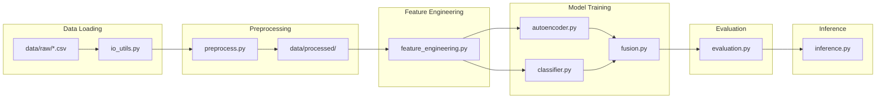

# Fraud Detection Platform

Modular, real-time-capable fraud detection built on the [IEEE-CIS Fraud Detection](https://www.kaggle.com/c/ieee-fraud-detection) dataset. The pipeline includes preprocessing, leak-free feature engineering, autoencoder anomaly detection (PyTorch), supervised classifiers (Logistic Regression + XGBoost), model fusion, and evaluation (PR-AUC primary).

## Structure

```
.
├── data/
│   ├── raw/                    # Place IEEE-CIS CSVs here
│   │   ├── train_transaction.csv
│   │   ├── train_identity.csv
│   │   ├── test_transaction.csv
│   │   └── test_identity.csv
│   └── processed/              # Created by pipeline
├── src/
│   ├── config.py               # Paths and hyperparameters
│   ├── io_utils.py             # Discover and load CSVs
│   ├── preprocess.py           # Merge, clean, encode, time-based split
│   ├── feature_engineering.py # Time, log amt, rolling stats, fraud rate
│   ├── autoencoder.py          # PyTorch AE (normal-only), anomaly score
│   ├── classifier.py           # LogReg + XGBoost
│   ├── fusion.py               # Meta-model on [xgb, logreg, ae]
│   ├── evaluation.py           # PR-AUC, ROC-AUC, F1, PR curve
│   └── inference.py            # Single-row predict + stream simulation
├── tests/                      # Pytest unit and integration tests
├── notebooks/
│   ├── 01_eda.ipynb
│   └── 02_training.ipynb
├── models/                     # Saved models and plots
├── main.py                     # CLI entry point
├── requirements.txt
└── README.md
```

## Data

1. Download the IEEE-CIS Fraud Detection dataset from Kaggle.
2. Place the CSVs under `data/raw/`. Filenames are discovered automatically (e.g. `train_transaction.csv`, `train_identity.csv`, `test_transaction.csv`, `test_identity.csv`).

## How to run

From the project root. Use a virtual environment so dependencies (e.g. matplotlib, torch) are installed locally:

```bash
# Create venv and install deps (do this once)
python3 -m venv .venv
source .venv/bin/activate   # On Windows: .venv\Scripts\activate
pip install -r requirements.txt

# Run full pipeline (preprocess -> features -> train -> evaluate -> infer)
python3 main.py pipeline
# or: python main.py pipeline

# Or run steps individually
python3 main.py preprocess    # Load, merge, clean, time-split, save
python3 main.py features     # Add features (no leakage)
python3 main.py train         # Train AE + LogReg + XGB + fusion
python3 main.py evaluate      # PR-AUC, confusion matrix, PR curve
python3 main.py infer         # Simulate streaming on last 100 test rows
```

Alternatively, use the helper script (tries `python3` then `python`):

```bash
./run.sh pipeline
./run.sh preprocess
```

**Tests:**

```bash
pytest tests/
```

Notebooks (run from project root so `main.py` is in cwd):

- `notebooks/01_eda.ipynb` — EDA: class balance, TransactionAmt, missingness, TransactionDT.
- `notebooks/02_training.ipynb` — Run preprocess, features, train, evaluate and show PR curve.

## Architecture (data flow)



- **Time-based split**: Train/test by `TransactionDT` (e.g. 80/20) to avoid leakage.
- **Features**: Time (hour, day), log amount, rolling counts/means per card, historical fraud rate (expanding + shift, train-only for rate).
- **Autoencoder**: Trained on non-fraud only; anomaly score = reconstruction error.
- **Fusion**: Meta Logistic Regression on `[xgb_proba, logreg_proba, ae_score]`; PR-AUC compared to XGBoost alone.
- **Inference**: Load artifacts, run preprocessing/features for one row, return fraud probability and risk bucket (low / medium / high).

## Metrics

- Primary: **PR-AUC** (average precision).
- Also: ROC-AUC, precision, recall, F1, confusion matrix, optional threshold tuning for high precision.

## License

Use as needed; dataset terms follow Kaggle / IEEE-CIS.
